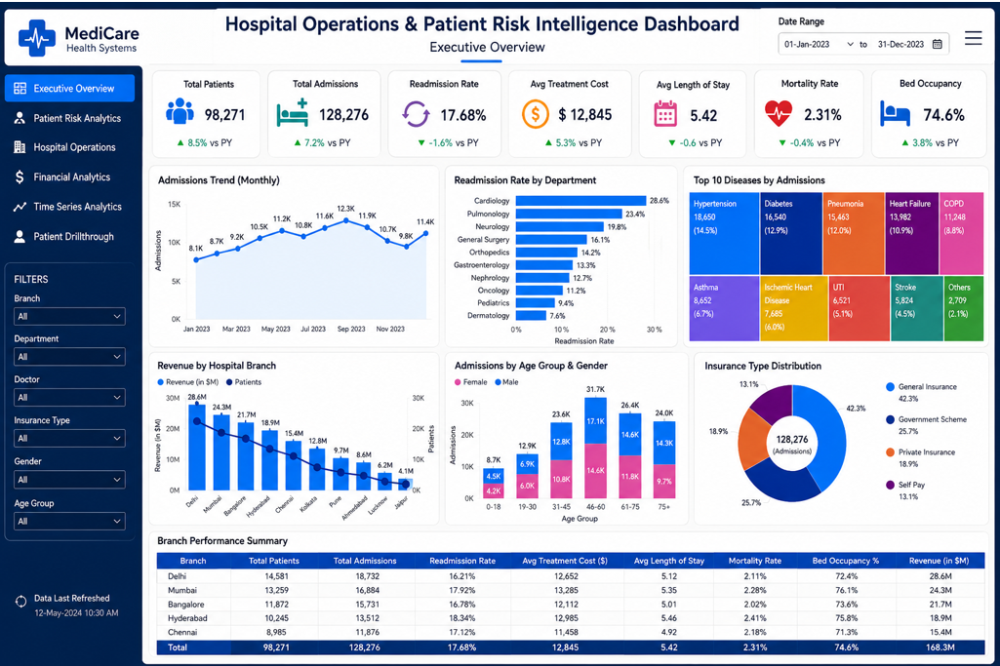

# Hospital Operations & Patient Risk Intelligence Dashboard

## Executive Overview

The **Hospital Operations & Patient Risk Intelligence Dashboard** is a comprehensive healthcare analytics solution designed for hospital administrators, healthcare executives, operational managers, and financial teams. The dashboard provides centralized visibility into patient admissions, readmissions, operational efficiency, financial performance, and patient risk indicators.

This dashboard enables healthcare organizations to make data-driven decisions by consolidating clinical, operational, and financial KPIs into a single interactive platform.

---
## Dashboard Preview

# Table of Contents

1. Introduction  
2. Project Objective  
3. Dashboard Features  
4. Dashboard Overview  
5. KPI Definitions  
6. Detailed Visual Explanations  
7. Filters & User Interactions  
8. Data Model & Architecture  
9. Business Benefits  
10. Key Insights  
11. Technical Implementation  
12. Suggested Enhancements  
13. Use Cases  
14. Conclusion  
15. Future Scope  

---

# 1. Introduction

Modern healthcare systems generate massive amounts of operational and clinical data every day. Managing this information effectively is essential for improving patient care quality, optimizing hospital resources, reducing operational costs, and increasing overall hospital efficiency.

The Hospital Operations & Patient Risk Intelligence Dashboard is designed to:

- Monitor hospital performance in real time
- Analyze patient admissions and readmissions
- Track treatment costs and mortality trends
- Evaluate hospital branch performance
- Analyze patient demographics and insurance distribution
- Support strategic healthcare decision-making

This dashboard serves as an executive-level healthcare intelligence platform.

---

# 2. Project Objective

The primary objectives of this dashboard are:

- Provide a centralized healthcare analytics platform
- Improve operational visibility across hospital branches
- Monitor critical healthcare KPIs
- Identify high-risk patient groups
- Optimize hospital resource utilization
- Reduce readmission and mortality rates
- Improve financial planning and revenue management
- Enable data-driven healthcare strategies

---

# 3. Dashboard Features

## Executive KPI Monitoring

The dashboard includes executive-level KPI cards for:

- Total Patients
- Total Admissions
- Readmission Rate
- Average Treatment Cost
- Average Length of Stay
- Mortality Rate
- Bed Occupancy Rate

---

## Patient Risk Analytics

Provides insights into:

- Department-wise readmission trends
- Disease prevalence
- Patient demographic analysis
- High-risk patient identification

---

## Operational Analytics

Tracks:

- Monthly admissions trends
- Branch performance
- Hospital occupancy rates
- Department efficiency

---

## Financial Analytics

Provides visibility into:

- Revenue by branch
- Treatment costs
- Insurance distribution
- Financial performance indicators

---

## Interactive Filtering

Users can dynamically filter the dashboard by:

- Branch
- Department
- Doctor
- Insurance Type
- Gender
- Age Group
- Date Range

---

# 4. Dashboard Overview

The dashboard is divided into multiple analytical sections.

---

## 4.1 Header Section

The top section contains:

- Dashboard title
- Executive overview label
- Date range selector
- Navigation/menu icon

This section provides context and time-period control.

---

## 4.2 Navigation Sidebar

The left navigation panel contains the following modules:

| Module | Description |
|---|---|
| Executive Overview | High-level healthcare KPIs |
| Patient Risk Analytics | Patient risk and disease analysis |
| Hospital Operations | Operational monitoring |
| Financial Analytics | Revenue and cost analysis |
| Time Series Analytics | Trend analysis over time |
| Patient Drillthrough | Detailed patient-level analysis |

---

## 4.3 KPI Summary Cards

The KPI cards provide quick executive insights into overall hospital performance.

| KPI | Value |
|---|---|
| Total Patients | 98,271 |
| Total Admissions | 128,276 |
| Readmission Rate | 17.68% |
| Average Treatment Cost | $12,845 |
| Average Length of Stay | 5.42 Days |
| Mortality Rate | 2.31% |
| Bed Occupancy Rate | 74.6% |

---

# 5. KPI Definitions

## Total Patients

Represents the total number of unique patients treated during the selected period.

### Importance
- Measures hospital reach
- Indicates patient growth trends
- Supports resource planning

---

## Total Admissions

Represents the total number of patient admissions.

### Importance
- Measures hospital workload
- Helps optimize staffing
- Tracks patient inflow

---

## Readmission Rate

Percentage of patients readmitted after discharge.

### Formula

Readmission Rate = (Readmitted Patients / Total Discharged Patients) × 100

### Importance
- Indicates quality of care
- Identifies treatment gaps
- Helps reduce healthcare costs

---

## Average Treatment Cost

Average medical treatment cost per patient.

### Importance
- Tracks healthcare expenses
- Supports budgeting
- Enables cost optimization

---

## Average Length of Stay

Average number of days patients stay admitted.

### Importance
- Measures operational efficiency
- Helps optimize bed utilization
- Indicates treatment effectiveness

---

## Mortality Rate

Percentage of admitted patients who died.

### Formula

Mortality Rate = (Total Deaths / Total Admissions) × 100

### Importance
- Measures patient care quality
- Supports clinical performance evaluation
- Helps identify healthcare risks

---

## Bed Occupancy Rate

Percentage of occupied hospital beds.

### Formula

Bed Occupancy Rate = (Occupied Beds / Total Beds) × 100

### Importance
- Measures hospital utilization
- Helps prevent overcrowding
- Supports infrastructure planning

---

# 6. Detailed Visual Explanations

## Admissions Trend (Monthly)

### Visualization Type
Line Chart

### Description
Shows monthly hospital admissions over the selected year.

### Insights
- Identifies seasonal admission trends
- Detects peak patient periods
- Supports demand forecasting

---

## Readmission Rate by Department

### Visualization Type
Horizontal Bar Chart

### Description
Displays readmission percentages across hospital departments.

### Key Insight
Cardiology shows the highest readmission rate, while Dermatology has the lowest.

---

## Top 10 Diseases by Admissions

### Visualization Type
Treemap

### Diseases Included
- Hypertension
- Diabetes
- Pneumonia
- Heart Failure
- COPD
- Asthma
- Stroke

### Business Value
- Supports disease management programs
- Helps prioritize healthcare initiatives

---

## Revenue by Hospital Branch

### Visualization Type
Combined Bar & Line Chart

### Branches Included
- Delhi
- Mumbai
- Bangalore
- Hyderabad
- Chennai

### Key Insight
Delhi generates the highest revenue and patient admissions.

---

## Admissions by Age Group & Gender

### Visualization Type
Stacked Column Chart

### Age Groups
- 0–18
- 19–30
- 31–45
- 46–60
- 61–75
- 75+

### Key Insight
The 46–60 age group contributes the highest admissions.

---

## Insurance Type Distribution

### Visualization Type
Donut Chart

### Insurance Categories
- General Insurance
- Government Scheme
- Private Insurance
- Self Pay

---

## Branch Performance Summary Table

### Metrics Included
- Total Patients
- Total Admissions
- Readmission Rate
- Average Treatment Cost
- Average Length of Stay
- Mortality Rate
- Bed Occupancy
- Revenue

---

# 7. Filters & User Interactions

| Filter | Purpose |
|---|---|
| Branch | Analyze individual hospital locations |
| Department | View department-specific metrics |
| Doctor | Analyze doctor-level performance |
| Insurance Type | Compare insurance categories |
| Gender | Perform gender analysis |
| Age Group | Analyze demographics |
| Date Range | Analyze historical trends |

---

# 8. Data Model & Architecture

## Data Sources

Potential data sources include:

- Hospital Information Systems (HIS)
- Electronic Health Records (EHR)
- Insurance Claims Systems
- Billing Systems
- Operational Databases
- Patient Registration Systems

---

## Data Model Structure

### Fact Tables
- Admissions Fact
- Billing Fact
- Patient Treatment Fact
- Mortality Fact

### Dimension Tables
- Date Dimension
- Hospital Branch Dimension
- Department Dimension
- Doctor Dimension
- Disease Dimension
- Insurance Dimension
- Patient Demographic Dimension

---

# 9. Business Benefits

## Operational Benefits
- Improved hospital efficiency
- Better resource utilization
- Faster operational decision-making

## Clinical Benefits
- Reduced readmission rates
- Better patient outcome monitoring
- Improved disease management

## Financial Benefits
- Revenue optimization
- Cost reduction
- Better insurance tracking

---

# 10. Key Insights

- Admissions peak during mid-year periods
- Cardiology has the highest readmission rate
- Hypertension and Diabetes dominate admissions
- Delhi branch generates maximum revenue
- The 46–60 age group contributes most admissions
- General insurance patients form the largest insurance segment

---

# 11. Technical Implementation

| Layer | Technology |
|---|---|
| Visualization | Power BI / Tableau |
| Database | SQL Server / PostgreSQL / Oracle |
| ETL | Power Query / Azure Data Factory |
| Backend Analytics | Python / SQL |
| Hosting | Power BI Service / Cloud Platform |

---

# 12. Suggested Enhancements

Future enhancements may include:

- AI-based patient risk prediction
- Predictive admission forecasting
- Real-time ICU monitoring
- Doctor performance analytics
- Patient satisfaction scoring
- Mobile-responsive dashboard

---

# 13. Use Cases

## Hospital Executives
Monitor overall hospital performance.

## Operations Managers
Track occupancy, admissions, and operational efficiency.

## Clinical Teams
Identify high-risk patients and disease trends.

## Finance Teams
Analyze treatment costs and revenue trends.

---

# 14. Conclusion

The Hospital Operations & Patient Risk Intelligence Dashboard is a powerful healthcare analytics platform that combines operational, clinical, and financial intelligence into a unified executive reporting solution.

The dashboard enables healthcare organizations to:

- Improve patient outcomes
- Enhance operational efficiency
- Reduce treatment costs
- Optimize resource allocation
- Improve strategic decision-making
- Deliver better healthcare services

---

# 15. Future Scope

Potential future improvements include:

- Machine learning integration
- Real-time patient monitoring
- Predictive healthcare analytics
- Multi-hospital benchmarking
- Automated reporting and alerts

---

